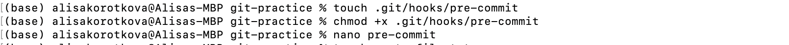

## Лабораторная работа 2
***
<h5 align="center">Министерство науки и высшего образования Российской Федерации

ФЕДЕРАЛЬНОЕ ГОСУДАРСТВЕННОЕ АВТОНОМНОЕ ОБРАЗОВАТЕЛЬНОЕ УЧРЕЖДЕНИЕ ВЫСШЕГО ОБРАЗОВАНИЯНАЦИОНАЛЬНЫЙ ИССЛЕДОВАТЕЛЬСКИЙ УНИВЕРСИТЕТ ИТМО

ITMO University


Отчет по лабораторной работе № 2

По дисциплине Информатика

Короткова Алиса Александровна

Факультет инфокоммуникационных технологий

Группа К3160

Направление подготовки 45.03.04 Интеллектуальные системы в гуманитарной сфере

Образовательная программа Языковые модели и искусственный интеллект</h5>
***


В ходе выполения лабораторной работы, изучив переменные, условные конструкции, функции и циклы, массивы в Bash, я написала написала скрипт, который на вход принимает IPv4-адрес в десятичном формате, а на выходе выводит данный IP-адрес в двоичном формате.

### Полный код файла `lab2.bash`

```bash
#!/bin/bash
#Ввод IP-адреса в переменную ip
read -p "Введите IP-адрес: " ip

#Создание массива из значений октетов IP-адреса, при правильном вводе их должно быть 4
IFS='.' read -r -a ipadress <<< "$ip"
check=0

#Первая проверка на правильность ввода: если введено 4 октета, но программа работает дальше
if ((${#ipadress[@]}==4))
then
  for i in ${ipadress[@]}
  do

    #Вторая проверка для каждого октета: число от 0 до 255
    if (($i>=0 && $i<=255))
    then
    x="$(echo "obase=2;$i" | bc)" #Перевод числа в двоичный формат
    #Добавление недостающих нулей
    if ((${#x}== 8))
    then
      result+=".$x"
    else
    result+="."
    for ((i=0; i<8-${#x}; i++))
    do
      result+="0"
    done
    result+="$x" #Добавление нового значения к результату
    fi

    #Случай если число не входит в нужный диапазон
    else
      check+=1
      break
    fi
  done

  #Вывод конечного результата
  if (($check==0))
  then
    echo "${result:1}"
  else
    echo "Неверный формат ввода IP"
  fi

#Случай если изначально не было 4 октетов
else
  echo "Неверный формат ввода IP"  
fi
```


### Описание кода и ход работы
1. Первым делом я создала новый файл с именем `lab2.bash`

```bash
touch lab2.bash
```

2. Приступила к написанию скрипта в редакторе Nano. Вписала `#!/bin/bash`, который указывает путь к интерпретатору. Для ввода использовала `read -p "Введите IP-адрес: " ip`, который записывает ввод пользователя в переменную `ip`.

3. Чтобы было удобнее работать с IP-адресом, я его переобразовала в массив, состоящий из 4 элементов, которыми являются значения октетов, те цифры, разделенные точками - `IFS='.' read -r -a ipadress <<< "$ip"`. Также создала перемнную `check`, для дальнейшей проверки ввода IP-адреса.




4. Следущим шагом я попыталась реализовать проверку на правильность формата ввода IP-адреса. Таким образом, первый `if ((${#ipadress[@]}==4))` проверяет, что пользователь ввел 4 октета (не один, не три). Если это верно, то мы продолжаем дальше, если нет, то работа скрипта заканчивается и выводится "Неверный формат ввода IP" Далее я рассматривала каждый октет отдельно, используя цикл `for i in ${ipadress[@]}`. Каждый элемент проверялся на то, что он входит в диапазон от 0 до 255 (если не входит, то к переменной check добавляется единица, из-за чего в дальнейшем выводится "Неверный формат ввода IP")


```bash
for i in ${ipadress[@]}
  do
  if (($i>=0 && $i<=255)) #проверка на диапазон
  then

    ...

  else
    check+=1
    break
  fi
done
```


5. Также во время цикла, после проверки, значение переводится из десятичной системы в двоичную, с помощью ...


Но возникла проблема, нужный формат вывода результата 00000000.00000000.00000000.00000000 (где в одном октете по 8 симфолов), поэтому нужен еще олин ... и цикл, чтобы добавить недостающие нолики.


   
```bash
if (($i>=0 && $i<=255))
then

    ...

else
check+=1
break
fi
```

В терминале отобразилась строка `Welcome to ITMO University`


