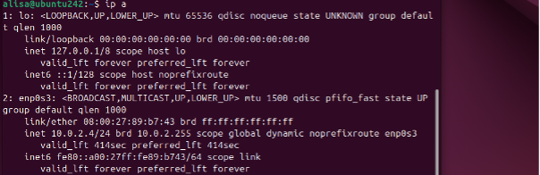

## Лабораторная работа 3
***
<h5 align="center">Министерство науки и высшего образования Российской Федерации

ФЕДЕРАЛЬНОЕ ГОСУДАРСТВЕННОЕ АВТОНОМНОЕ ОБРАЗОВАТЕЛЬНОЕ УЧРЕЖДЕНИЕ ВЫСШЕГО ОБРАЗОВАНИЯНАЦИОНАЛЬНЫЙ ИССЛЕДОВАТЕЛЬСКИЙ УНИВЕРСИТЕТ ИТМО

ITMO University

Отчет по лабораторной работе № 3

По дисциплине Информатика

Короткова Алиса Александровна

Факультет инфокоммуникационных технологий

Группа К3160

Направление подготовки 45.03.04 Интеллектуальные системы в гуманитарной сфере

Образовательная программа Языковые модели и искусственный интеллект</h5>
***

В ходе выполения лабораторной работы, я настроила три виртуальные машины Ubuntu в VirtualBox (А, Б и В) и между ними организовала сетевой доступ, таким образом:

1. доступ есть из машины А в машину Б
2. доступ есть из машины А в машину В
3. нет доступа из машины Б в машину В

### Ход работы

1. Первым делом я создала три виртуальные машины Ubuntu в VirtualBox.

2. Я создала 2 NAT Networks (NATNetwork, NATNetwork1 - с разными ip адрессами) с помощью Tools в VirtualBox.

3. Далее в настройках А, Б и В я подключила их к этим сетям. Таким образом, что для А на первом адапрере - NATNetwork, а на втором - NATNetwork1. Для Б - NATNetwork. Для В - NATNetwork1.

Для машины А

Для машины Б

Для Машины В

4. Для всех трех виртуальных машин я проверила доступ в сеть Интернет с помощью команды `ping google.com`.

Для машины А

Для машины Б

Для Машины В

Во всех трех случаях доспут есть.

4. Следущим шагом я проверила ip адреса для каждой машины с помощью команды 'ip a':

А - 10.0.2.15 и 10.0.3.4

Б - 10.0.2.4

В - 10.0.3.5

5. Дальше проверила как работает сетевой доступ, который я настроила. Я вводила 'ping ipaddress'

Для машины А (есть доступ в А и в Б)

Для машины Б (есть доступ в А, но нет в В)

Для Машины В (есть доступ в А, но нет в Б)

Таким образом, все работает так, как было задано условием лабораторной.

### Примеры работы скрипта

