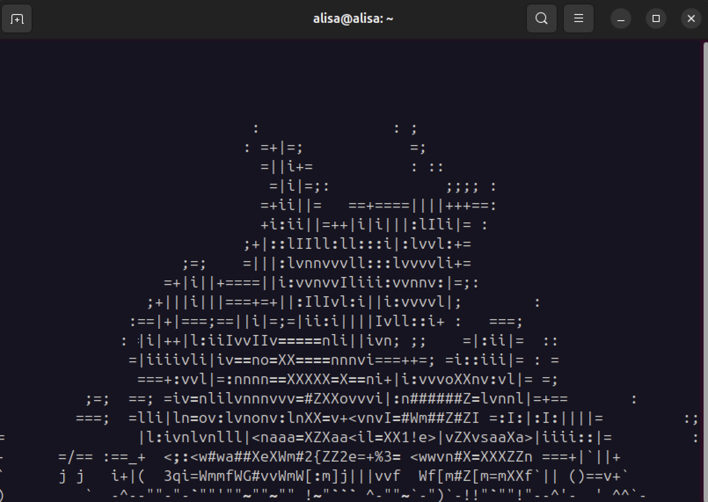
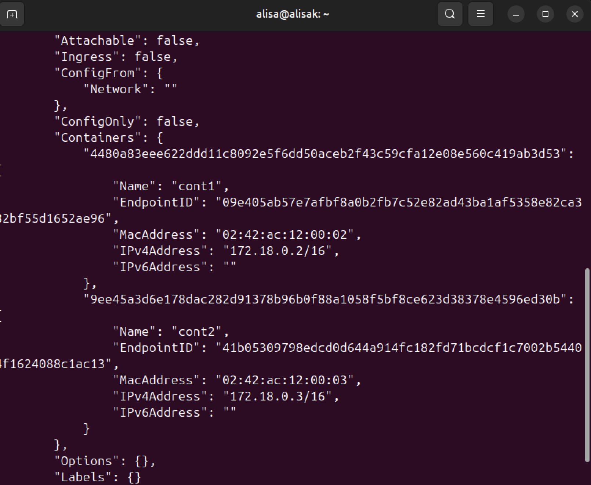
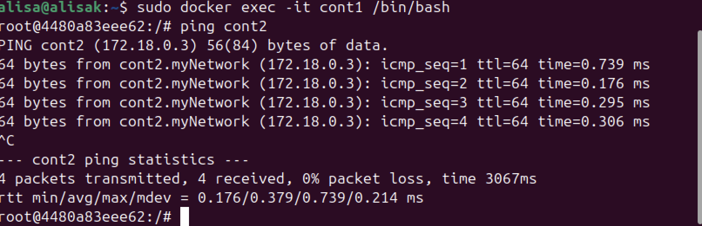
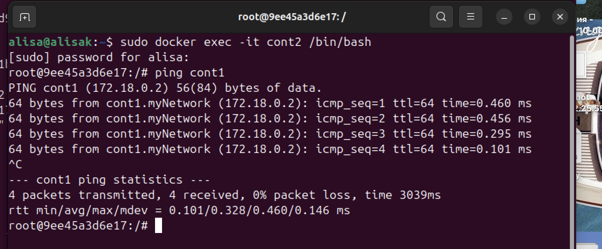

## Лабораторная работа 4
***
<h5 align="center">Министерство науки и высшего образования Российской Федерации

ФЕДЕРАЛЬНОЕ ГОСУДАРСТВЕННОЕ АВТОНОМНОЕ ОБРАЗОВАТЕЛЬНОЕ УЧРЕЖДЕНИЕ ВЫСШЕГО ОБРАЗОВАНИЯНАЦИОНАЛЬНЫЙ ИССЛЕДОВАТЕЛЬСКИЙ УНИВЕРСИТЕТ ИТМО

ITMO University


Отчет по лабораторной работе № 4

По дисциплине Информатика

Короткова Алиса Александровна

Факультет инфокоммуникационных технологий

Группа К3160

Направление подготовки 45.03.04 Интеллектуальные системы в гуманитарной сфере

Образовательная программа Языковые модели и искусственный интеллект</h5>
***

### Запуск aafire
1. Создала Dockerfile и вписала туда код
```
  FROM ubuntu:latest
  RUN apt-get update && apt-get install -y libaa-bin
```
libaa-bin - это пакет программ, использующих библиотеку aalib, с помощью которой запустила  aafire
   
2. Затем запустила его по схеме 
```
  sudo docker built -t aafire .
  sudo docker run -it aafire /usr/bin/aafire
```
  


  ### Настройка сети и соединения
1. Изменила Dockerfile и добавила во вторую строку команду скачивания пакета с ping
```
  FROM ubuntu:latest
  RUN apt-get update && apt-get install -y libaa-bin
``` 
2. Собрала образ и запустила 2 контейнера, назвала их cont1 и cont2
```
  sudo docker build -t aafire_ping .
  sudo docker run -it --name cont1 aafire_ping
  sudo docker run -it --name cont2 aafire_ping
```
С помощью команды `sudo docker ps` убеждаемся, что оба контейнера запущены:


3. Создала сеть myNetwork и подключила контейнеры к этой сети
```
  docker network create myNetwork
  docker network connect myNetwork cont1
  docker network connect myNetwork cont2
```
Теперь при помощи команды `docker network inspect myNetwork` посмотрим настройки созданной сети.



4. Далее я вошла в оболочку контейнера, чтобы из него запинговать другой контейнер, а те проверить соединение между ними
```
   sudo docker exec -it cont1 bash
```
   и отправила пинг к другому контейнеру из первого контейнера
```
   ping cont2
```



   Аналогично для другого контейнера:
```
   sudo docker exec -it cont2 bash
```
   и отправила пинг к другому контейнеру из второго контейнера
```
   ping cont1
```


