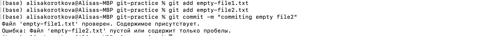

## Лабораторная работа 5
***
<h5 align="center">Министерство науки и высшего образования Российской Федерации

ФЕДЕРАЛЬНОЕ ГОСУДАРСТВЕННОЕ АВТОНОМНОЕ ОБРАЗОВАТЕЛЬНОЕ УЧРЕЖДЕНИЕ ВЫСШЕГО ОБРАЗОВАНИЯНАЦИОНАЛЬНЫЙ ИССЛЕДОВАТЕЛЬСКИЙ УНИВЕРСИТЕТ ИТМО

ITMO University


Отчет по лабораторной работе № 5

По дисциплине Информатика

Короткова Алиса Александровна

Факультет инфокоммуникационных технологий

Группа К3160

Направление подготовки 45.03.04 Интеллектуальные системы в гуманитарной сфере

Образовательная программа Языковые модели и искусственный интеллект</h5>
***

Задания выполнялись в этом репозитории:
https://github.com/alisakorotkova/git-practice


## Задание 1 - Автоматизация проверки формата файлов при коммите

Задача - автоматизировать проверку формата файлов при коммите с использованием Git Hooks.

Все `hooks` хранятся во вложенной директории `.git/hooks`. Сначала выполняется hook `pre-commit`, еще до того, как мы вводим сообщение коммита. Он используется для проверки файлов, которые собираются закоммитить, чтобы убедиться, что мы ничего не забыли, запустить тесты или проверить все, что необходимо в коде. Поэтому именно в файле `pre-commit` и нужно написать неоходимые условия для коммита. 

Таким образом, создаю файл `pre-commit`.
```
touch .git/hooks/pre-commit
```  
Команда `chmod +x .git/hooks/pre-commit` делает файл `pre-commit` исполняемым для всех пользователей. 
```
chmod +x .git/hooks/pre-commit
```

`+x` : указывает на то, что нужно добавить право на выполнение `(x — execute)` для всех пользователей.


Полный bash-скрипт файла `pre-commit`, который будет выполнять проверку того, что коммитится файл формата .txt и в файле присутствует какой-то текст.


Проверка работы кода:
1. Я создала пустой файл `empty-file1.txt` и попробовала его закоммитить. У меня не получилось это сделать, и в терминал вывелось сообщение:
```
Ошибка: Файл 'empty-file1.txt' пустой или содержит только пробелы.
```  


2. Я создала второй файл и заполнила его пробелами, его тоже можно считать пустым, поэтому опять вывелось сообщение ошибки. Но также я заполнила первый файл текстом - его получилось закоммитить:

```
Файл 'empty-file1.txt' проверен. Содержимое присутствует.
Ошибка: Файл 'empty-file2.txt' пустой или содержит только пробелы.
```  


## Задание 2 - Использование Git Flow в проекте
 
Cоздание новой функциональности для моего проекта с использованием Git Flow.

1. Устанавливаю Git Flow установлен на локальной машине:

```
sudo port install git-flow
```

2. В корне репозитория выполняю инициализацию Git Flow.

```
git flow init
```


3. Создаю ветку для новой функциональности, она называется "task-management":

```
git flow feature start task-management
```


4. Вношу изменения в код для добавления функционала управления задачами (в файл task_manager.py):

```
def create_task(title, description):
    # Логика создания задачи
    print(f"Создана новая задача: {title}")
```


Выполняю коммит изменения по мере разработки:

```
git add task_manager.py
git commit -m "Добавлен функционал управления задачами"

```

5. После завершения разработки функции завершаю фичу и объединяю ее с основной веткой:

```
git flow feature finish task-management

```


Git Flow автоматически переключится на ветку development и выполнит слияние. Если есть конфликты, их нужно разрешить.

6. Переключаюсь на ветку "development" и начнаю создание релиза:

```
git checkout development
git flow release start v1.0.0
```


7. Вношу изменения, связанные с релизом (обновляю версию в файле version.txt):

```
echo "v1.0.0" > version.txt
git add version.txt
git commit -m "Обновлена версия для релиза v1.0.0"
```


8. Завершаю релиз и объединяю его с ветками "development" и "main":

```
git flow release finish v1.0.0
```


9. Создаю hotfix (в процессе использования может быть выявлена критическая ошибкау, но у меня ошибки никакой не возникнет, но hotfix все равно создадим):

```
git flow hotfix start hotfix-1.0.1
```


10. Вношу изменения для исправления ошибки и коммитите:

```
# Исправление ошибки
git add file_with_error.py
git commit -m "Исправлена критическая ошибка"
```

11. Завершаю hotfix и объединяю его с ветками "development" и "main":

```
git flow hotfix finish hotfix-1.0.1
```


12. Завершение работы и отправка изменений на удаленный репозиторий.

```
git push origin develop
git push origin main
```


